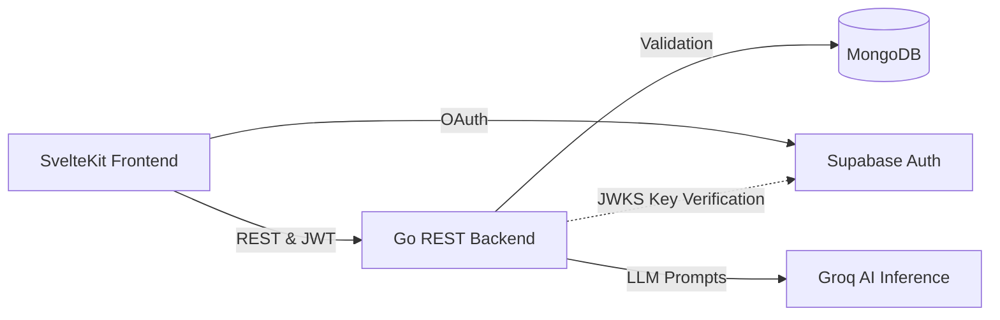

# Tech Stack & Architecture

Cascade is built using a modern decoupled architecture.

## Tech Stack Overview

| Layer | Technology |
|---|---|
| **Frontend** | [SvelteKit](https://kit.svelte.dev/) (Svelte 5, TypeScript, Vite) |
| **Backend** | [Go](https://go.dev/) 1.22 — standard `net/http` |
| **Auth** | [Supabase](https://supabase.com/) + Google OAuth 2.0 |
| **Database** | [MongoDB](https://www.mongodb.com/) (via `mongo-driver/v2`) |
| **Editor** | [TipTap](https://tiptap.dev/) (ProseMirror based rich-text editor) |
| **AI Inference**| [Groq](https://groq.com/) API (llama-3.1-8b-instant model) |
| **Styling** | Vanilla CSS — glassmorphism, pinkish theme |

## System Design

### Flow of Authentication
1. **User Sign in**: The user clicks "Continue with Google". Supabase handles the OAuth flow and returns a signed JWT.
2. **Backend Validation**: The frontend passes the JWT to the Go `GET /auth/callback` endpoint as a bearer token. The Go backend fetches the JWKS from Supabase and cryptographically verifies the token.
3. **Database Upsert**: Upon successful verification, the user record is either created or updated (login timestamp) in the MongoDB `users` collection.
